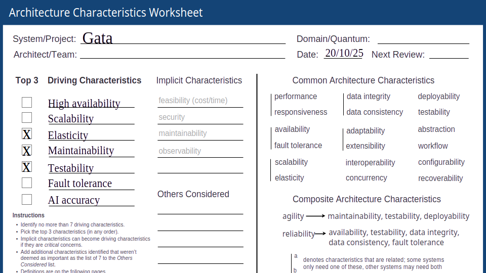
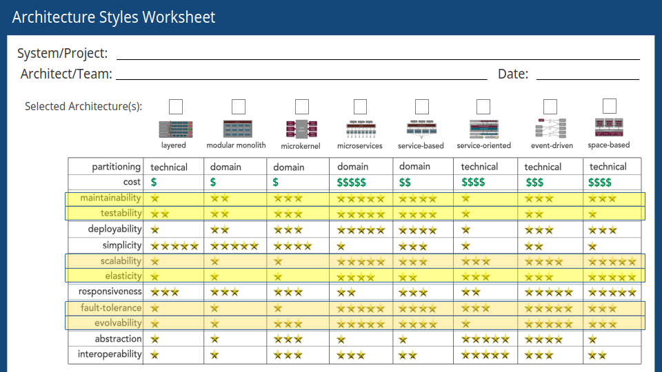
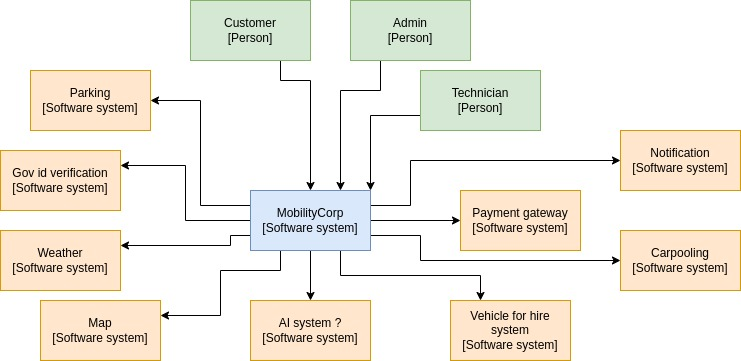
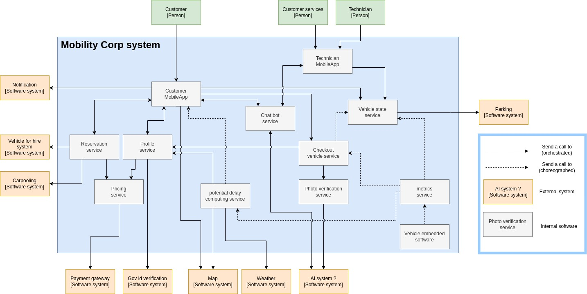

# MobilityCorp | Architectural Kata (Fall 2025)

## The Gata Team

 - [Benoit CHASSIGNOL](https://www.linkedin.com/in/benoit-chassignol-844716a1/)
 - [David LOIRET](https://www.linkedin.com/in/david-loiret/)
 - [Jimmy ROGALA](https://www.linkedin.com/in/jimmy-rogala/)
 - [Ulysse HUMBERT](https://www.linkedin.com/in/ulyssehumbertgonzalez/)

## Introduction

MobilityCorp provides short-term rentals for last-mile transport with bikes, scooters, cars, or vans in the European Union.

In each of the 27 countries, we offer 5,000 bikes, 5,000 scooters, 200 cars, and 200 vans. Users rent these vehicles on our booking platform 7 days in advance
for cars and vans and 30 minutes before the trip for scooters and bikes.

All these means of transport run on electric motors, so we have technicians who maintain these vehicles and, in particular, change the batteries when they are worn out.
Each vehicle sends metrics (gps and battery level) every 30 seconds.

Details in [business goals page](https://github.com/cndys/gata/blob/main/1_business_goals.md)

### Main Chalenges

* right vehicles aren’t in the right places,
* when ppl will want to use the vehicles ?
* can we anticipate customer needs ?

## Functional requirements

1. User Management & Authentication
2. Booking & Reservation Management
3. Vehicle Management
4. Payment Processing
5. Return & Verification
6. Technician Operations
7. AI-Powered Services
8. Reporting & Analytics

Details in [specific page](https://github.com/cndys/gata/blob/main/2_business_requirements.md)

## Non functionnal requirements

We thought about these non functionnal requirements  :

1. **High Availability and fault tolerance**,
2. **Scalability and Elasticity** : elasticity is the most important at short terme to use less resources at off-peak time,
5. **Compliance and Legal** : which is for us, the need of testability and maintainability and is the most important point because of need to comply with legal evolution in EU about cars/bikes/scooter sharing and IT,
9. **AI & Machine Learning** : need for model accuracy.

Then we choose the main characteristics of our system :

## Architecture choice
The main non functionnal requirements lead us to :

We could choose service based or even microkernel if MobilityCorp just started with one or two countries
or if it was at a POC level, but we need elasticity to cut cost on cloud providers so we choose microservices
with a bit of event driven on some part of our system. Microservices helps us in the need for agility
to quickly change AI providers.

## Design

### C4 - C1 context 

We rely on nine softwares third party softwares,
but most of these are stable systems working for years.

### C4 - C2 containers

We organized an event storming to have a shared overview of our business flows and designed this diagram :

## ADR

We have 8 ADRs :
1. [Microservices Architecture](ADRs/ADR-001-microservices-architecture.md)
2. [Event-Driven Architecture](ADRs/ADR-002-event-driven-architecture.md)
3. [AI/ML Strategy](ADRs/ADR-003-AI-ML-strategy.md)
4. [Computer Vision for Return Verification](ADRs/ADR-004-computer-vision-for-return-verification.md)
5. [Mobile-First Architecture](ADRs/ADR-005-mobile-first-architecture.md)
6. [PostgreSQL for Transactional and Operational Data](ADRs/ADR-006-PostgreSQL.md)
7. [ADR-007: Object Storage (S3) for Media Files and Data Lake Storage](ADRs/ADR-007-object-Storage.md)
8. [ADR-008: Batch Processing over Real-time Analytics for Reporting](ADRs/ADR-008-Batch-Processing.md)

